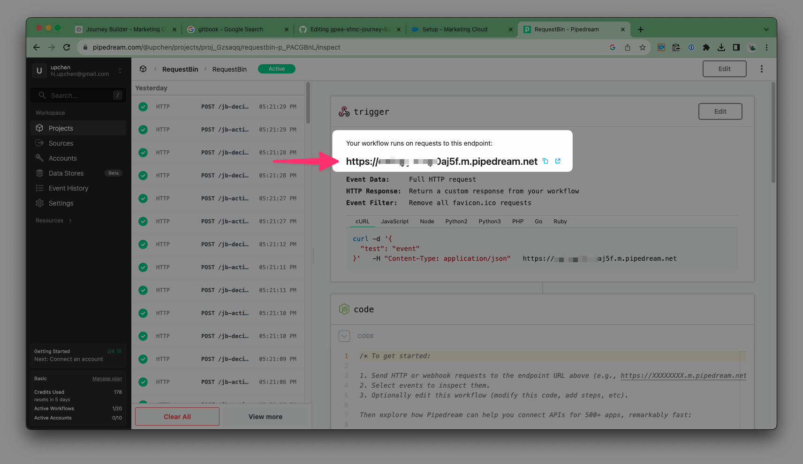

# gpea-sfmc-custom-activity-sample README

Created: October 23, 2023 8:37 PM
Updated: October 23, 2023 10:10 PM

# gpea-sfmc-custom-activity-sample

This repository is for demonstrating how to build a basic marketing cloud journey builder **custom activity** and **custom decision split**. The purpose is to connect journey builder with external services, such as WhatsApp vendors.

# Pre-request

- A static web server can host HTML/CSS/JavaScript files and provide public HTTPS connections.
- [RequestBin](https://pipedream.com/requestbin) to capture and investigate requests sent from the marketing cloud using public HTTPS URLs. Alternatively, any other mock service will also work.

# Basic Setup Custom Activity & Decision Split

1. Update the file `gpea-sfmc-journey-builder-custom-activity-sample/jb-activity/config.json`, replace all `[https://YOUR_REQUESTBIN_URL](https://YOUR_REQUESTBIN_URL)` with your request bin URL.


    
   

3. The config file should look like this after updated.

    ```json
    {
    	...
    	"arguments": {
    		"execute": {
    			"inArguments": [
    			...
    			"url": "https://***86ap0aj5f.m.pipedream.net/jb-activity/execute/"
    		}
    	},
    	"configurationArguments": {
    		"save": {
    			"url": "https://***86ap0aj5f.m.pipedream.net/jb-activity/save"
    		},
    		"publish": {
    			"url": "https://***86ap0aj5f.m.pipedream.net/jb-activity/publish"
    		},
    		"validate": {
    			"url": "https://***86ap0aj5f.m.pipedream.net/jb-activity/validate"
    		},
    		"stop": {
    			"url": "https://***86ap0aj5f.m.pipedream.net/jb-activity/stop"
    		}
    	}
    	...
    }
    ```

4. Upload the `jb-activity` `jb-decision-split` folders to your Web Server and have the https version URL. Say `https://HOST_NAME/jb-activity`, `https://HOST_NAME/jb-decision-split`
5. Create A Marketing Cloud Package

    

6. And Create Component
    - Component Type: Journey Builder Activity
    - Category: Messages
    - Endpoint URL: Fillin the URL for folder `jb-activity`, Say `https://HOST_NAME/jb-activity`

    

7. Add another component for custom decision split activity
    - Component Type: Journey Builder Activity
    - Category: Flow Control
    - Endpoint URL: Fillin the URL for folder `jb-decision-split`, Say `https://HOST_NAME/jb-decision-split`
8. Navigate to Journey Builder, you should able to see the newly created custom activities.

    


# Custom Activity


When you click on the Custom Activity, a JSON edit panel will pop up. This panel is used for demonstration purposes, as the JSON file contains the settings that the journey builder will execute for each contact. In a production environment, it is recommended to build a graphical user interface (GUI) for a better user experience.

### JSON explains:

- `arguments.execute.inArguments`: Define which fields should be send to external server. And the external server URL is defined in `arguments.execute.url`
    - `{"ContactKey": "{{Contact.Key}}"}` : The Subscriber Key of Marketing Cloud
    - `{"FIELD_NAME": "{{Contact.Attribute.Contacts.DATAEXTENSION_NAME.FIELDNAME}}"}` You can also define any `FIELD_NAME` and refer to the Contact Data, `Contacts.DATAEXTENSION_NAME.FIELDNAME`
- `schema.arguments.execute.outArguments` : Define this activity should expose some variable for the following activity to use.

### Sample body sent to external server (`arguments.execute.url`)

```json
{
  "inArguments": [
    {
      "ContactKey": "0032u00000lgB1zAAE"
    },
    {
      "InteractionEmail": "jachow@greenpeace.org"
    },
    {
      "ContactMobilePhone": "+852 96599170"
    }
  ],
  "outArguments": [],
  "activityObjectID": "ecd2c003-63b1-4a29-8304-e4265054a80e",
  "journeyId": "d86d04f8-590e-4c88-b8a7-b5d80438a286",
  "activityId": "ecd2c003-63b1-4a29-8304-e4265054a80e",
  "definitionInstanceId": "673b8793-4a42-4fef-8185-f10756d01c2e",
  "activityInstanceId": "00331f75-bad7-4150-90fe-137c806187c8",
  "keyValue": "0032u00000lgB1zAAE",
  "mode": 0
}
```

Expected the external server response

```json
{
  "messageId": "2X9syrZYxjOGTPi4TWnvnh9qQhw"
}
```

Where the `messageId` is the `outArguments` which defined in `schema.arguments.execute.outArguments`. This response will expose to the following activities.

# Custom Decision Split


### JSON explains:

- When the journey builder executes this decision split, it will collect the `arguments.execute.inArguments` and send them to an external server defined in `arguments.execute.url`. The external server should return a JSON response with the `branchResult` field.
- `arguments.execute.inArguments[3].messageId`
    - `{"messageId": "{{Interaction.REST-1.messageId}}"}` This means that the decision split takes the `outArguments.messageId` from the `REST-1` activity.
- `outcomes[].arguments.branchResult`
    - sample: `outcomes[].arguments.branchResult="uchen"`
    - The `branchResult` defines the all the outcomes of decision split.
    - The `branchResult` is captured from the external server response.

### Sample body sent to external server (`arguments.execute.url`)

```json
{
  "inArguments": [
    {
      "ContactKey": "0032u00000EQjsoAAD"
    },
    {
      "InteractionEmail": "uchen@greenpeace.org"
    },
    {
      "ContactMobilePhone": "+852 91212312"
    },
    {
      "messageId": "2X9sz43e2kummnfX44GMXseiUsb"
    }
  ],
  "outArguments": [],
  "activityObjectID": "933c2de1-f8c9-4047-84ea-933a088def09",
  "journeyId": "d86d04f8-590e-4c88-b8a7-b5d80438a286",
  "activityId": "933c2de1-f8c9-4047-84ea-933a088def09",
  "definitionInstanceId": "3303ad80-f97a-4529-a9c2-d6f6fe0e71be",
  "activityInstanceId": "00ea8d34-b916-43ff-9854-288654508345",
  "keyValue": "0032u00000EQjsoAAD",
  "mode": 0
}
```

Expected the external server response.

```json
{"branchResult":"uchen"}
```

In this response, the contact will go through the "uchen" branch.
